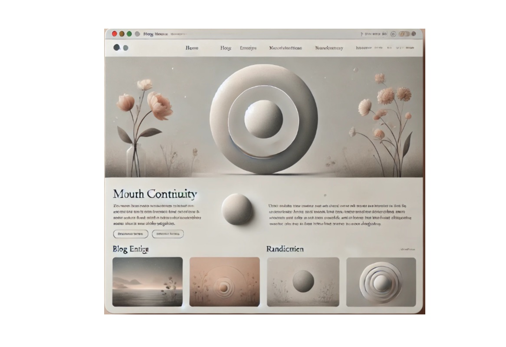

# Welcome to my Blog!
### A Memorial Blog in Honor of My Mother

## Blogsite Overview
**Live Demo** ➔ [Website Preview](https://thapapb.github.io/LandingPage/)

### Planned Sections and Features

1. **Homepage**
    - Introduction Section: A brief description of the blog’s purpose and the inspiration behind it.
    - Chronological Reading Section: Displays the latest blog entry preview, with a link to read in sequence.
    - About Author Section: Personal background and the author’s journey.

2. **Blog Page**
    - Lists all entries with links, sortable by date.
    - Includes filters and search for easier navigation.

3. **Contact Page**
    - Contains contact information for reader inquiries or messages.

4. **Support Page**
    - Provides options for readers to support the author, such as links to Patreon, Buy Me a Coffee, etc.

---

### Project Structure

This blog project is organized as follows:
- `frontend/`: Contains the HTML, CSS, and JavaScript files for the user interface.
- `backend/`: Contains server code, API endpoints, and database connections.

---

### Development Progress

- [x] GitHub Repository Initialized
- [x] Basic Structure of `index.html` with Introduction and Blog Preview Sections
- [ ] Backend API Setup and Database Integration
- [ ] Connect Frontend to API for Dynamic Content Loading
- [ ] Add Monetization and Support Features

---

### Technologies Used

- **Frontend**: HTML, CSS, JavaScript (React/Vue optional)
- **Backend**: Django or Express.js (Node.js), PostgreSQL/MySQL
- **Deployment**: GitHub Pages (for static demo), Cloud Hosting for dynamic functionality(Render)

---
